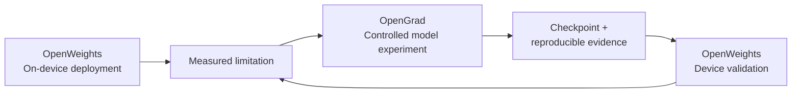
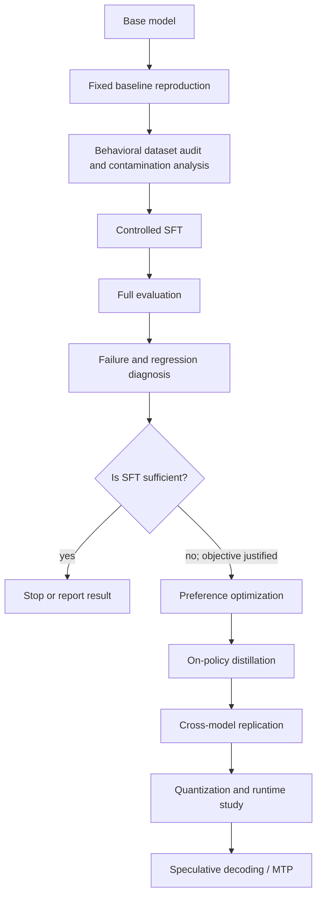
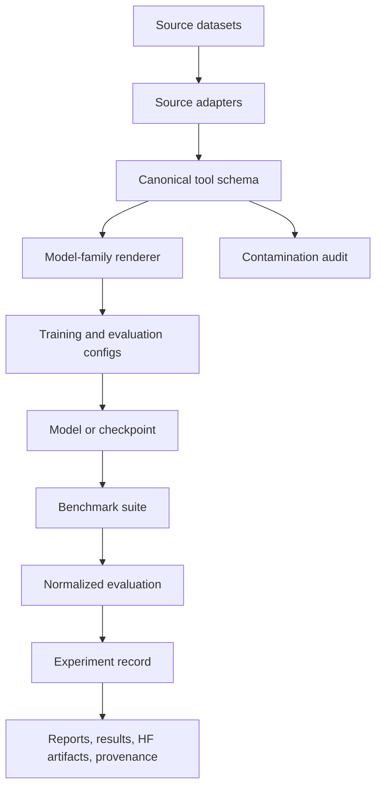

<div align="center">


# OpenGrad

**Building in Public.** Every gradient is a hypothesis. Every checkpoint is evidence.

Open empirical research on capability–efficiency tradeoffs in small open-weight language models.

[](https://github.com/arjhinety/OpenGrad/actions/workflows/ci.yml)
[](pyproject.toml)
[](LICENSE)
[](reports/M1_DPO_EVALUATION.md)

</div>

OpenGrad studies how much capability can be extracted from small open-weight language models through controlled post-training, and how much inference efficiency can subsequently be gained without unacceptable capability regression.

Model changes are hypotheses, not improvements. Every intervention is measured. Every regression matters. Failed experiments remain part of the record, and every reported result must be reproducible.

> OpenGrad documents all research journeys, whether successful or failed. The repository provides a post-training experiment operating system with executed SFT and DPO trainer backends, an on-policy distillation scaffold whose live training path is not yet implemented, a 17-benchmark external evaluation registry (Tiers A–E) plus the executed When2Call behavioral held-out, a reserved configuration for planned native MTP/speculative decoding (no runtime support or benchmark executed), an OpenWeights integration for downstream on-device validation (no device study executed), and clean extension boundaries for future Reinforcement Learning (RL).

---

## Primary Research Highlights & Architecture

### 1. Comprehensive Post-Training Evaluation Benchmarks (Tiers A to E)
OpenGrad rejects single headline accuracy scores and implements a rigorous, versioned multi-tier benchmark system with independent axes for capability, agent behavior, systems performance, and speculative decoding:
- **Tier A (Primary Tool-Use Research):** BFCL V4, tau3-bench, ACEBench.
- **Tier B (General & Regression):** IFBench, IFEval, LiveBench, MMLU-Pro, GSM8K, ARC-Challenge.
- **Tier C (Agent Transfer & On-Device):** MCPMark, AgentBench FC, Terminal-Bench, TUA-Bench, OpenWeights.
- **Tier D (Stretch):** GAIA (multimodal transfer delta).
- **Tier E (Systems & Speculative):** Performance Microsuite (10 deterministic frozen prompts), Speculative Replay.
- **Documentation:** See [Benchmark Strategy](docs/evaluation/BENCHMARK_STRATEGY.md), [Speculative Decoding & MTP](docs/evaluation/SPECULATIVE_DECODING.md), [Adding a Benchmark](docs/evaluation/ADDING_A_BENCHMARK.md), and [Adding an Inference Backend](docs/evaluation/ADDING_A_BACKEND.md).

### 2. On-Device Mobile Testing with OpenWeights & Android Studio (integration; device validation planned)
Connecting direct post-training research to consumer mobile devices:
- **OpenWeights Integration:** Independent on-device engine (`github.com/alpharomercoma/openweights`).
- **No Prompt Bloat:** Evaluates small models under OpenWeights' lightweight system prompts (<150 tokens) across both `CallFormat.BARE` and `CallFormat.TAGGED` arms for 18 on-device tools without massive prompt overheads.
- **Android Studio & Device Testing Environment:** Local host provisioned with Android Studio 2024.2.1, Android SDK platform-tools (`adb`), and a Google Pixel 7 phone AVD (`pixel_phone`) under Android 14.0 API 34.
- **Status:** The adapter, the `CallFormat` arms, and the versioned Tier C benchmark definition (`openweights`) exist, but **no post-training device study has been executed** — no OpenGrad result rests on device measurements yet. A provisioned test host is not completed empirical validation.
- **Documentation:** See [On-Device Testing with OpenWeights](docs/evaluation/OPENWEIGHTS_ON_DEVICE_TESTING.md).

### 3. Post-Training Experiment Operating System & Future RL Architecture
- **Complete Experiment Lifecycle:** Hypothesis $\to$ Config $\to$ Preflight $\to$ Training $\to$ Checkpoints $\to$ Evaluation $\to$ Regression Detection $\to$ Promotion Policy.
- **Trainer Backends:** SFT and DPO, both executed on GPU. On-policy distillation is scaffolded with decoupled `RolloutProvider` and `TeacherProvider` interfaces, but its live path is unimplemented and only the mock providers run — see the [M2 decision](reports/M2_DECISION.md).
- **Future Reinforcement Learning (RL) Boundary:** Architectural foundation ready for GRPO, PPO, RLOO, and verl without restructuring the codebase.
- **Harness-Agnostic Agent Boundary:** OpenGrad is driven by any agent harness through the same documented `opengrad … --json` CLI. `integrations/opengrad-mcp/` packages that boundary as a dependency-free stdio MCP server for evaluation, readiness, gating, and post-training orchestration — no vendor plugin required.
- **Documentation:** See [Experiment Foundation](docs/EXPERIMENT_FOUNDATION.md), [Training Lifecycle](docs/TRAINING_LIFECYCLE.md), [Future RL Integration](docs/FUTURE_RL_INTEGRATION.md), and [Agent / Harness Integration](docs/AGENT_INTEGRATION.md).

---

## At a glance

| Question | Current answer |
| --- | --- |
| What is being studied? | Capability–efficiency tradeoffs in small open-weight models. |
| What is the first study? | Reliable tool use, beginning with the executed Qwen3.5-2B B0 baseline. |
| What happens after the baseline? | Controlled SFT, diagnosis, conditional preference optimization, distillation, replication, and later systems studies. |
| How is improvement judged? | Capability, regression, reliability, efficiency, cost, and reproducibility—not one headline score. |
| Are failures publishable? | Yes. Failed, null, rejected, and non-reproducible runs are evidence. |
| Are results available now? | Yes — the **B0 baseline** and seven post-training interventions, including historical negative results, Canonical-v2 recovery and ablations, and the promoted M1-v2 result. See [Results](#results). |

## Why OpenGrad?

Small open-weight models can run locally, reduce inference cost and latency, operate on constrained hardware, and make direct model research more reproducible. They also make tradeoffs impossible to ignore:

```text
tool accuracy       ↑    general instruction following ↓
throughput          ↑    quality                       ↓
quantized size      ↓    reasoning/tool reliability   ↓
specialization      ↑    out-of-domain capability      ↓
```

A recipe is not better merely because one metric increases. OpenGrad evaluates whether an intervention improves the intended behavior while preserving general capability, reliability, efficiency, cost, and reproducibility.

## From deployment problems to research questions

OpenGrad did not choose tool calling and inference efficiency arbitrarily. Its initial questions were motivated by practical deployment findings from [OpenWeights](https://github.com/alpharomercoma/openweights), an independent open-source Android project developed by `alpharomercoma`. OpenWeights runs open-weight Hugging Face models locally on constrained consumer hardware, primarily through llama.cpp/GGUF, with an additional ExecuTorch runtime. OpenWeights is developed by Alpha Romer Coma, founder of [Experimental Machines](https://experimentalmachines.org/), an independent research group ("Test what others assume"); OpenGrad is maintained by founding member Arjhine Ty as a direct supporting project to that research program.

OpenWeights exposed two problems that conventional model capability claims can hide:

- **Tool support is not reliable tool-use policy.** A model can emit valid call syntax and still under-call when external information is needed, over-call for facts it should answer directly, select based on tool ordering, fail to ask for missing information, or behave differently across model families.
- **Model fit is not interactive efficiency.** Large system prompts, tool definitions, conversation history, observations, multiple inference passes, KV-cache behavior, CPU/GPU choice, memory pressure, and thermal state all affect whether an agent is useful on a phone.

These are observations from OpenWeights, not OpenGrad results. OpenGrad turns them into controlled questions about the weights, then plans to return validated checkpoints to constrained downstream evaluation. The detailed provenance and scoped measurements are in [From deployment problems to research questions](docs/research/motivation.md).



This is the intended feedback loop. The repositories are independently maintained: OpenGrad does not own OpenWeights, and OpenWeights is not an OpenGrad subproject. Both are connected through Experimental Machines, within which OpenGrad directly supports OpenWeights by answering the model-level questions its deployment record exposed.

## Research questions

OpenGrad's program asks:

### RQ1 — Reliable tool policy

Can controlled post-training improve when and how small models use tools, beyond the tool syntax already present in their instruct checkpoints?

### RQ2 — Transfer

Do those improvements transfer from controlled evaluations into realistic agent runtimes and workload patterns such as those exposed by OpenWeights?

### RQ3 — Regression

What ordinary instruction-following, reasoning, calibration, latency, or robustness capabilities regress as tool reliability improves?

### RQ4 — Distillation

When SFT reaches its ceiling, can on-policy distillation from a larger model improve the remaining decision-boundary failures?

### RQ5 — Constrained inference

Can target-attached/native speculative decoding improve small-model decode efficiency without the memory and runtime cost of maintaining a separate draft model?

### RQ6 — Capability × efficiency

Do post-training gains survive quantization and optimized constrained-device inference?

## Study 001 — Reliable Tool Use in Small Language Models

The first track asks whether a small open-weight model can reliably decide **when and how** to use tools while retaining ordinary instruction-following capability. It is not an attempt to add tool-call grammar to a model that cannot serialize calls. It targets the decision boundary: `CALL`, `DO NOT CALL`, `ASK FIRST`, `SELECT`, `GROUND ARGUMENTS`, `CHAIN`, `PARALLELIZE`, `RECOVER`, and `STOP`.

It has been carried through baseline measurement, a controlled SFT comparison, and a preference-optimization stage, with the results in [Results](#results). The study will cover, as the corresponding evaluations are implemented:

- deciding whether to call a tool, answer directly, ask for clarification, or reject an unsupported request;
- selecting the correct tool and producing schema-valid, grounded arguments;
- parallel tool calls and sequential tool dependencies;
- consuming tool observations and handling tool failure;
- maintaining state across multi-turn tasks.

The first baseline is [`Qwen/Qwen3.5-2B`](registry/models.yaml), recorded as `qwen3.5-2b` at an immutable revision in the [experiment definition](configs/experiments/tool_calling/qwen35_2b_baseline.yaml). It has been **measured on the frozen held-out set** (3,650 distinct examples, engine vLLM 0.29.0 on an A100): the model calls a tool on 97% of gold-`CALL` items but also on 64% of items that should be answered, clarified, or refused. See the [B0 result](reports/baselines/qwen35_2b_baseline/RESULT.md). Post-training interventions have since been run and are recorded in the [M0 SFT execution report](reports/M0_SFT_EXECUTION_REPORT.md).

## Experimental decision pipeline

The roadmap is a decision process, not a mandatory recipe. Preference optimization is used only if diagnosis identifies a failure that such an objective is appropriate to address. Later stages require evidence from earlier stages.



## Current research status

Gate status: on a fresh checkout `opengrad readiness` reports `FAIL` with blocking gates that depend on local evidence and hardware rather than on the code — `evaluation_materialization`, `contamination_gate`, `gpu_probe`, `real_b0`, and `baseline_artifacts`. The processed corpus, the adjudicated contamination evidence, and the GPU measurements are materialized locally and are not committed, so the gates cannot pass from a clone alone; `experiment_preflight` additionally warns while the working tree holds uncommitted changes. The code-level checks do pass — registry validation and experiment-config validation both report `PASS` — and the baseline itself is real:

```bash
opengrad readiness configs/experiments/m0_sft.yaml   # evaluate the SFT config explicitly
```

That is a statement about the *contract*, not about work done — the M0 lineage spans five completed SFT arms on GPU (one negative on corpus v1, one partial recovery on corpus v2, the definitive final-v2, and the paired minus-xLAM joint-removal ablations), after two early CUDA-OOM attempts and one scaffold run (see [Results](#results)). The distinction still matters because the default `opengrad readiness` evaluates the baseline config — where SFT-specific data gates auto-pass — so an SFT config must be named explicitly for its gates to mean anything. The definitive config is [`m0_sft_canonical_v2_final.yaml`](configs/experiments/m0_sft_canonical_v2_final.yaml), and it declares a measured yield report, so its trainability and supervision-composition gates read real evidence rather than idling.

| Stage | Status | Evidence |
| --- | --- | --- |
| Repository and research infrastructure | VALIDATED | [Bootstrap report](docs/foundation/BOOTSTRAP_REPORT.md) |
| CPU fixture and preflight validation | VALIDATED | [Phase 0.5 report](docs/foundation/PRE_EXPERIMENT_REPORT.md) |
| Qwen3.5-2B baseline reproduction | **EXECUTED — REAL RESULT** | [B0 result](reports/baselines/qwen35_2b_baseline/RESULT.md); `runs/tool_calling/qwen35_2b/baseline/experiment.json` |
| Dataset materialization and audit | **Canonical-v2 FINAL**: 4 sources, 173,237 records, 161,966 trainable, fingerprint `8ced403b…`. BUTTON and LoopTool excluded — upstreams unavailable | [Completion report](reports/CANONICAL_V2_COMPLETION_REPORT.md) |
| Tool-use SFT | **EXECUTED — 1 NEGATIVE (CORPUS V1), 1 PARTIAL RECOVERY, 1 DEFINITIVE (NOT PROMOTED), 2 JOINT-REMOVAL ABLATIONS (BOTH NEGATIVE)** | [M0 report](reports/M0_SFT_EXECUTION_REPORT.md) · [final](reports/M0_CANONICAL_V2_FINAL_EVALUATION.md) · [ablations](reports/M0_V2_FINAL_MINUS_XLAM_ABLATION_EVALUATION.md) |
| Preference optimization | **EXECUTED — 1 HISTORICAL NEGATIVE, 1 PROMOTED** | [M1-v1 negative result (M0 report §5)](reports/M0_SFT_EXECUTION_REPORT.md#5-dpo-was-blocked-now-executed-and-also-negative) · [M1-v2 promoted evaluation](reports/M1_DPO_EVALUATION.md) |
| On-policy distillation | **SCAFFOLD ONLY — LIVE PATH NOT IMPLEMENTED; NOT RUN (mock-only, not justified)** | [M2 decision](reports/M2_DECISION.md) · [M0 report §6](reports/M0_SFT_EXECUTION_REPORT.md) |
| Cross-model replication | PLANNED | [Roadmap](ROADMAP.md) |
| Quantization and runtime evaluation | INTERFACE_ONLY — no execution | [Optimization layer](docs/optimization/README.md) |
| Speculative decoding / MTP | PLANNED — no runtime support or benchmark executed | [Reserved configuration](configs/inference/speculative/README.md) |

`VALIDATED` here means repository or fixture infrastructure passed its checks. It does not mean an ML model or real benchmark was validated. The status vocabulary used by experiment records is defined by the [experiment schema](registry/experiments.schema.json).

## Dataset releases

OpenGrad publishes large normalized research artifacts on Hugging Face while GitHub remains the canonical home for normalization code, schemas, manifests, audits, provenance, and experiment definitions. Browse them as collections: [models](https://huggingface.co/collections/arrochi112/opengrad-models-6aa3c7ea9ae58be5adbb113e) and [datasets and evaluation records](https://huggingface.co/collections/arrochi112/opengrad-datasets-and-evaluation-records-6aa3c7eb4514d9bc27e5d160).

### Canonical-v2 (current)

[`arrochi112/OpenGrad-ToolPolicy-Canonical-v2`](https://huggingface.co/datasets/arrochi112/OpenGrad-ToolPolicy-Canonical-v2) at Hub commit `66470c07ed0a79941f49a5cf67c1b3b1a7d8196e`. **173,237 canonical records, 161,966 of them trainable**, across four sources in 176 hash-verified Parquet shards. Its fingerprint is `8ced403b996e563d6e279aee7fdb346fc829fe5ff6af9daf8ef47c0a4007e161`, proven reproducible by a delete-and-rebuild.

This is the corpus the definitive M0 ran on. Every record declares a **supervision contract**:

| Contract | Trainable | What it supervises |
|---|---:|---|
| `COMPLETE_TRAJECTORY` | 105,876 | A full trajectory: every call answered by its result, ending in a terminal response |
| `CALL_PREDICTION` | 56,090 | Next-call prediction: the terminal tool call *is* the target, so no result is required |

Exactly one rule differs between the contracts — whether a terminal call needs a future environment response. Everything else fails closed under both: undeclared tools, invalid arguments, malformed calls, orphaned results, FIFO order violations. A malformed call stays quarantined even when its *shape* is valid for the other contract. See the [supervision contract report](reports/SUPERVISION_CONTRACT_REPORT.md).

### Canonical-v1

[`arrochi112/OpenGrad-ToolPolicy-Canonical-v1`](https://huggingface.co/datasets/arrochi112/OpenGrad-ToolPolicy-Canonical-v1) at Hub commit `bb295d8a4ad64f7e8161044ad2fa34f873ede418`. **213,951 canonical records** across six sources in 216 shards. It remains pinned by B0 and every earlier result, and is left untouched.

Its own training boundary yielded 48.9% of those records usefully and only **9** with a tool call, which is what the v1 post-training collapse was caused by — recorded in the [M0 execution report](reports/M0_SFT_EXECUTION_REPORT.md).

### Partial-v2 snapshot

[`arrochi112/OpenGrad-ToolPolicy-Canonical-v2-M0-snapshot`](https://huggingface.co/datasets/arrochi112/OpenGrad-ToolPolicy-Canonical-v2-M0-snapshot), unchanged, 103,036 records, three of six sources. It is the exact corpus that produced the first successful M0 and is distinguished from the final v2 by name, fingerprint and source count. **xLAM contributed zero gradients to it.**

The release deliberately **excludes** every evaluation and preference split, so it is the training-side corpus and never the held-out set. The held-out benchmark is materialized separately from its own pinned upstream revision; see the [B0 result](reports/baselines/qwen35_2b_baseline/RESULT.md).

The dataset registry records source identity, revisions, intended stages, split restrictions, contamination risk, and processing state. OpenGrad preserves two axes: where an example came from (source provenance) and what it trains (behavioral capability). Datasets are sources of evidence, not capabilities by themselves.

| Dataset | Purpose in the program | Current support | Training eligibility | Provenance |
| --- | --- | --- | --- | --- |
| [xLAM / APIGen Function Calling 60k](registry/datasets.yaml) | Function selection and argument generation | v1: 59,370 retained. v2 final: 57,342 canonical, **56,090 trainable** under `CALL_PREDICTION` | SFT (corpus v1, v2 final) | Salesforce snapshot revision recorded; upstream is access-gated, so the v2 build reconstructs from the published v1 derivative with per-record verification |
| [When2Call](registry/datasets.yaml) | Call/no-call decisions and answer quality | v2 final: 6,505 records, yield 1.000 | SFT, preference, evaluation remain separate | NVIDIA HF and GitHub sources recorded |
| [ToolACE](registry/datasets.yaml) | Complex schemas, candidate tools, parallel/dependent calls, negatives | v2 final: 11,051 canonical, 2,259 trainable (8,476 end on an unanswered call and stay quarantined) | SFT (corpus v1, v2 final) | Team-ACE source revision recorded |
| [BUTTON / BUTTONInstruct](registry/datasets.yaml) | Multi-turn compositional trajectories | Not included in v2: upstream is access-gated | Not trained on | Repository commit recorded |
| [LoopTool-23k](registry/datasets.yaml) | Loop/tool trajectories requiring lineage audit | Not included in v2: upstream was not located | Not trained on | Source revision recorded; possible derivation overlap |
| [Glaive Function Calling v2](registry/datasets.yaml) | Additional function-calling coverage | v2 final: 98,339 canonical, 97,112 trainable | SFT (corpus v1, v2 final) | HF snapshot revision recorded |

These states are deliberately different:

```text
adapter implemented ≠ fixture validated ≠ metadata validated
metadata validated ≠ full dataset materialized ≠ used in an experiment
```

> **Terminology note.** `M0`/`M1`/`M2` name two unrelated things in this repository: **dataset mixtures** (this section) and **training phases** (M0 SFT, M1 DPO, M2 on-policy distillation — see [Results](#results) and [EXPERIMENT_STATUS.md](docs/EXPERIMENT_STATUS.md)). The mixtures are written below as mixture-M0/M1/M2 to keep them distinct; the executed M1 DPO phase did not train on mixture-M1.

The historical [`tool-calling-mixture-v1`](configs/data/tool_calling/mixture_v1.yaml) is retained as **mixture-M0**, a source-oriented control hypothesis. **mixture-M1** is the behaviorally balanced [`balanced_policy_v1`](configs/data/tool_calling/balanced_policy_v1.yaml); **mixture-M2** is the baseline-dependent, schema-ready [`residual_policy_v1`](configs/data/tool_calling/residual_policy_v1.yaml). Only mixture-M0 has been trained — against both canonical corpus v1 and the corrected v2 (see [Results](#results)); mixture-M1 and mixture-M2 were never trained. See the [tool-use mixture methodology](docs/data/tool-use-mixture-methodology.md) and [behavior matrix](docs/data/training-behavior-matrix.md). Materialization preserves source metadata and terms, verifies checksums, normalizes, labels, deduplicates, audits overlap, and freezes versioned artifacts ([protocol](docs/data/DATASET_MATERIALIZATION_PROTOCOL.md)).

`Salesforce/APIGen-MT-5k` is explicitly excluded from the clean default because of possible τ-bench/τ² overlap. If it is ever used, it must use the contaminated namespace and its scores cannot be presented as clean generalization ([contamination configuration](configs/data/tool_calling/contamination.yaml)).

## Benchmark program

OpenGrad has deterministic mock smoke harnesses for the following configured evaluation families. A smoke harness validates the local result contract with fixture predictions; it is not a real model evaluation. One row below is not a harness: When2Call is the frozen behavioral held-out set that B0 and every post-training checkpoint were actually scored on.

| Benchmark | Measures in the registry | Harness status | Real score available? | Revision state |
| --- | --- | --- | --- | --- |
| BFCL V4 | Function-call accuracy | Mock smoke harness | **No** | Recommended Gorilla revision pinned |
| When2Call | Call decision, answer quality | **Executed** — 3,650 held-out examples, engine vLLM 0.29.0 | **Yes** — B0 and 12 candidate checkpoints | Frozen in baseline v2 config; the training corpora exclude it by construction |
| τ-bench / τ² | Task success, reward | Mock smoke harness | **No** | Recommended repository revision pinned |
| ToolSandbox | Tool-use correctness | Mock smoke harness | **No** | Authoritative metadata pending |
| MCPMark Verified | Task success | Mock smoke harness | **No** | Stretch evaluation; metadata pending |
| Toolathlon | Task success | Mock smoke harness | **No** | Stretch evaluation; metadata pending |

The full benchmark registry is [`registry/benchmarks.yaml`](registry/benchmarks.yaml). The When2Call behavioral held-out is a real, executed measurement with published scores in [Results](#results); every *external* benchmark family remains `FROZEN_NOT_EXECUTED`, so **no external benchmark score exists**. That distinction is the whole point of keeping the behavioral suite separate from the external ones: the behavioral set answers "did tool policy change", and the external sets would answer "did anything else break". Only the first has been measured.

### Benchmark inventory and counting convention

The registry contains 23 benchmark identifiers, so a count is only meaningful when the subset is named:

- **17 external benchmarks in Tiers A–E** — the primary external suite listed above. Every one is `FROZEN_NOT_EXECUTED` and has no score.
- **1 executed behavioral held-out** — When2Call (`when2call-eval`), the only benchmark with real scores.
- **1 legacy registration** — τ-bench/τ² (`tau-bench-tau2`), kept for its pinned revision; the Tier A `tau3` entry is the current registration.
- **3 stretch families awaiting authoritative metadata** — ToolSandbox, MCPMark Verified, and Toolathlon. These three, plus BFCL V4, are the mock smoke-harness rows in the table above.
- **1 internal regression suite** — `internal-no-tool-regression` (public fixtures only; the secret holdout is not materialized here).

That is 17 + 1 + 1 + 3 + 1 = 23. Earlier README phrasing said "16-benchmark" while the Tier A–E list it referred to already named 17 entries; the external suite count is 17 and the full registry total is 23.

### Baseline execution gate

The frozen B0 definition is `configs/evaluation/tool_calling/qwen35_2b_baseline.yaml` and points to held-out v2. Before using a GPU, run:

```text
opengrad baseline --dry-run
```

This loads the held-out manifest, renders the exact Qwen prompt, calls
`InferenceBackend.generate()`, parses native Qwen tool calls, evaluates routing,
and writes predictions, metrics, a residual profile, and environment capture.
The deterministic backend is a plumbing test only; it must never be reported as
a model score.

Benchmarks are measurements, not the product requirement. The intended evaluation stack is: deterministic behavior and regression checks; established external tool-use benchmarks; and downstream agent/runtime evaluation under realistic constrained-device conditions. The third layer is planned, not implemented. A benchmark gain that becomes worse in an OpenWeights-style workload is not an unqualified success.

## Measurement, not leaderboard chasing

### Tool-use capability

The canonical schema and evaluation contracts support measurement of tool-call structure and behavior, including:

- call/no-call/clarification/impossible-tool decisions;
- tool selection and schema-valid arguments;
- argument correctness and grounding;
- parallel calls, sequential dependencies, and tool observations;
- tool-failure handling and multi-turn state;
- ordinary instruction-following and structured-output regression.

The repository provides contracts and fixtures for these behaviors, and empirical model scores now exist for the B0 baseline and seven post-training interventions (see [Results](#results)).

### Systems efficiency — planned

An isolated, optional [optimization producer layer](docs/optimization/README.md)
(`src/opengrad/optimization/`) now exists so that a trained checkpoint can be turned into
an optimized checkpoint through a recorded recipe and full provenance. It changes
artifacts; the existing inference backend executes them and the existing benchmark and
evaluation system measures them. No optimization has been executed, NVIDIA ModelOpt is
not a dependency, and every capability answer is `UNKNOWN`. See the
[ModelOpt integration report](reports/MODELOPT_INTEGRATION_REPORT.md).

Future runtime studies may measure time to first token, prefill and decode throughput, end-to-end latency, VRAM/RAM, checkpoint size, quantization effects, speculative acceptance and accepted length, drafted/accepted tokens per step, draft/target verification cost, total model footprint, added parameters, KV-cache use, load time, output equivalence, parser/EOS/tool failures, and energy or thermal behavior where reliable instrumentation exists. The [efficiency notes](docs/inference/efficiency.md) keep this axis separate from behavioral correctness.

OpenGrad uses **target-attached/native speculative decoding** to mean a speculative mechanism trained into or closely attached to the target model, such as an MTP or Medusa-style head, an architecture-permitted EAGLE-like method, a self-speculative method, or another attached mechanism. It does not mean that external draft-model speculation is inherently bad, and no approach is presumed faster. Where feasible, the comparison is ordinary autoregressive decoding versus external draft-model speculation versus target-attached/native speculation.

An efficiency gain is not automatically desirable if capability or reliability falls substantially.

## Capability × efficiency

OpenGrad has two related but distinct directions:

| Capability | Efficiency |
| --- | --- |
| SFT; preference optimization when justified; distillation; tool use; specialization; robustness | Quantization; speculative decoding; draft/target decoding; native MTP; architecture-aware decoding; device deployment |

```text
             Capability
                 ↑
                 │       desirable region
                 │            ●
                 │
                 └────────────────────→ Efficiency
```

## Research architecture

The repository separates declarative identity from semantics, model boundaries, and evidence:



- `registry/` — dataset, benchmark, model, runtime, hardware, provenance, and experiment contracts.
- `src/opengrad/` — canonical data, fixture adapters, parsing, contamination tools, evaluation schemas, lineage, stage gates, and reporting utilities.
- `configs/` — data, evaluation, model, training, inference, and planned experiment configurations.
- `experiments/`, `reports/`, `results/` — evidence namespaces; the B0 baseline and seven post-training interventions are recorded. `runs/<id>/experiment.json` owns experiment state, `reports/` holds the written analyses, and [`results/registry.jsonl`](results/README.md) is a derived, rebuildable index over the run artifacts.
- `docs/` — methodology, architecture, data, benchmark, inference, reproducibility, contribution, and publication protocols.
- `integrations/` — harness-facing integrations over the `opengrad … --json` boundary; `opengrad-mcp/` is the dependency-free stdio MCP server.
- `release/` — tracked Hugging Face release definitions, dataset-card template, attribution audit, and citations.
- `hf/` — model-card, dataset-card, and experiment-report templates.

Training and inference have now been executed on a GPU (NVIDIA A100-SXM4-80GB). Large data and checkpoints remain outside Git and must be referenced by immutable revisions and hashes.

## Reproducibility and provenance

An OpenGrad result should preserve, where applicable:

- base model and exact model revision;
- tokenizer revision and chat/parser configuration;
- dataset repository, revision, split, preprocessing configuration, and hash;
- benchmark repository, split, evaluator version, and revision;
- seed, hyperparameters, training and runtime software;
- hardware, driver, accelerator runtime, and compute provider;
- checkpoint lineage, quantization, inference settings, and generated artifacts;
- known regressions, failures, uncertainty, and limitations.

Unavailable fields remain `null` or `UNKNOWN`; they are never inferred. **An untraceable score is not an OpenGrad result.** See [reproducibility](docs/research/reproducibility.md), the [experiment schema](registry/experiments.schema.json), and the [provenance schema](registry/provenance.schema.json).

## Negative results are results

OpenGrad retains successful runs, failed runs, regressions, null results, non-reproductions, and rejected hypotheses. This prevents duplicated failed work, exposes unstable recipes and model-family differences, makes sensitivity visible, and reduces cherry-picking. A lower score can be useful evidence if the comparison and failure analysis are reproducible.

That extends to our own operational mistakes. [docs/INCIDENT_LOG.md](docs/INCIDENT_LOG.md) records errors that changed what we can claim, including one where checkpoint weights were deleted before upload and could not be reproduced (INC-0001). Reports affected by an incident carry a correction pointing at the entry, and past entries are never rewritten to look better.

## Provenance across projects

OpenGrad uses explicit labels when referring to the neighboring deployment project:

```text
Observed in OpenWeights
Motivated by OpenWeights
OpenGrad hypothesis
OpenGrad planned experiment
OpenGrad reproduced
OpenGrad result
```

`Observed in OpenWeights` is not `OpenGrad result`. OpenGrad must independently execute and record any claimed reproduction. See the [motivation and provenance note](docs/research/motivation.md) for direct links to the OpenWeights tool-calling, first-turn latency, inference-engine, and speculative-decoding records.

## Results

> **Eight empirical results are recorded: the B0 baseline and seven post-training interventions.** Historical M0-v1 and M1-v1 were negative; partial-v2 recovered from a data defect; definitive M0-final-v2 restored balanced call behavior but did not pass its original promotion gate; both joint-removal ablations reduced recall; and M1-v2 made a small favorable movement and was promoted under the prospective v4 policy.

📊 **[Baseline-to-M0-final findings — charts and comparison](reports/visual/index.html)** (also [on the model card](https://huggingface.co/arrochi112/OpenGrad-Qwen3.5-2B-M0-SFT-CanonicalV2-Final/blob/main/findings.html)). These charts cover the lineage through M0-final-v2; the complete intervention record, including the later ablations and M1-v2, is in the table below. Every figure is computed from the available per-example predictions rather than copied from a report.

The machine-checkable index of every experiment record — lifecycle status, `validity`, selected checkpoint, confirmatory score, report, and published artifact — is [`docs/EXPERIMENT_STATUS.md`](docs/EXPERIMENT_STATUS.md), regenerated from the authoritative run artifacts and required to be byte-identical by the test suite. Scaffold-era and mock records appear there but are excluded from the executed-intervention count by their `validity` annotation.

The table below lists interventions; the baseline is recorded by the experiment store instead.

| Experiment | Model | Change | Capability Δ | Regression | Evidence status | Report |
| --- | --- | --- | --- | --- | --- | --- |
| [`qwen35_2b_m0_sft_full_v3`](runs/qwen35_2b_m0_sft_full_v3/) | Qwen3.5-2B | M0 SFT on canonical corpus v1 | `call_f1` 0.6191 → **0.0000** | Collapsed: `call_recall` 0.9722 → 0.0000 | Negative; weights lost | [M0 report](reports/M0_SFT_EXECUTION_REPORT.md) |
| [`qwen35_2b_m1_dpo_v1`](runs/qwen35_2b_m1_dpo_v1/) | Qwen3.5-2B | DPO on When2Call preference pairs | `call_f1` 0.6191 → **0.1715** best | Over-calling fixed, tool calling destroyed | Negative; not reproducible | [M0 report §5](reports/M0_SFT_EXECUTION_REPORT.md#5-dpo-was-blocked-now-executed-and-also-negative) |
| [`qwen35_2b_m0_sft_v2corpus`](runs/qwen35_2b_m0_sft_v2corpus/) | Qwen3.5-2B | M0 SFT on partial corpus v2 | `call_f1` 0.6191 → **0.5995**; macro recall 0.3621 → **0.6416** | None measured | Partial recovery; not promoted | [M0 report §8](reports/M0_SFT_EXECUTION_REPORT.md#8-corpus-v2-testing-the-root-cause-rather-than-asserting-it) |
| [`m0_sft_canonical_v2_final`](runs/m0_sft_canonical_v2_final/) | Qwen3.5-2B | M0 SFT on **frozen Canonical-v2** | `call_f1` **0.7470**; recall 0.5342 → **0.7594** | Precision −0.026, over-call +0.058 vs partial-v2 | Confirmatory; not promoted | [Execution](reports/M0_CANONICAL_V2_FINAL_EXECUTION_REPORT.md) · [Evaluation](reports/M0_CANONICAL_V2_FINAL_EVALUATION.md) |
| [`m0_v2_final_minus_xlam_fixed_compute`](runs/m0_v2_final_minus_xlam_fixed_compute/) | Qwen3.5-2B | **joint xLAM + CALL_PREDICTION removal**, fixed compute (2,400 steps) | `call_f1` 0.7470 → **0.6030**; recall 0.7594 → **0.4879** | Precision +0.054, over-call −0.079 vs full corpus | Confirmatory; not promoted | [Execution](reports/M0_V2_FINAL_MINUS_XLAM_ABLATION_EXECUTION.md) · [Evaluation](reports/M0_V2_FINAL_MINUS_XLAM_ABLATION_EVALUATION.md) |
| [`m0_v2_final_minus_xlam_matched_exposure`](runs/m0_v2_final_minus_xlam_matched_exposure/) | Qwen3.5-2B | **joint xLAM + CALL_PREDICTION removal**, matched exposure (2,119 steps) | `call_f1` 0.7470 → **0.5557**; recall 0.7594 → **0.4238** | Precision +0.072, over-call −0.105 vs full corpus | Confirmatory; not promoted | [Execution](reports/M0_V2_FINAL_MINUS_XLAM_ABLATION_EXECUTION.md) · [Evaluation](reports/M0_V2_FINAL_MINUS_XLAM_ABLATION_EVALUATION.md) |
| [`m1_dpo_canonical_v2_final_v2`](runs/m1_dpo_canonical_v2_final_v2/) | Qwen3.5-2B | M1 DPO calibration from selected M0-final-v2 | `call_f1` 0.7470 → **0.7548**; recall → **0.7748** | Over-call +0.0024; unsupported −0.0044 vs M0 | **Confirmatory; promoted** | [Execution](reports/M1_DPO_EXECUTION_REPORT.md) · [Evaluation](reports/M1_DPO_EVALUATION.md) |

Four caveats belong next to those numbers rather than in a footnote.

**B0's `call_f1` comes from a degenerate policy.** It scores 0.6191 by calling a tool on 64.3% of examples whose correct answer is not a call, recalling 97.2% of gold CALLs with 1.3% unsupported-accuracy. The metric that flatters the baseline is the one metric where the corrected model is still slightly behind; on balanced per-class recall the trained model is ahead by 0.28. Do not read the leaderboard column as the finding.

**The historical M1-v1 DPO result is not reproducible, and its best checkpoint no longer exists.** Its steps 100 and 200 were deleted before upload, and a repeat run with config, data, seed, and environment pinned did not reproduce the trajectory. The direction of that failure holds in both runs; the claim that degradation is monotone from step 100 is withdrawn. The new parent-based M1-v2 is a separate identity and is reported independently in the table above.

**The definitive M0 is not a promotion.** By the repository's own promotion policy every checkpoint is `REJECT`, including the selected one, because B0's recall of 0.9715 is itself a property of over-calling and the policy caps over-call at 0.20 while forbidding a recall drop beyond 0.10. The gate was left as written rather than adjusted after seeing the result. That tension is a finding for the next experiment's design, not a threshold to move.

**The minus-xLAM arms are a joint removal, not a pure xLAM ablation.** Canonical-v2 maps xLAM to *every* `CALL_PREDICTION` record and the other three sources to `COMPLETE_TRAJECTORY`, so removing xLAM also removes the corpus's entire call-prediction supervision channel. The two arms measure **removing xLAM together with that channel**; they cannot separate source identity from supervision type, so **no xLAM-specific causal claim** is made. Both arms lose far more recall than over-calling, and the arm that trains more (fixed compute) does better — the recall loss tracks the missing supervision, not the reduced budget. The separate `CALL_PREDICTION`-only vs `COMPLETE_TRAJECTORY`-only design is prepared and unrun, and is source-confounded in the same way. See the [ablation design](reports/M0_V2_FINAL_ABLATION_DESIGN.md).

Published artifacts for these runs:

| Artifact | Kind | Contents |
| --- | --- | --- |
| [`OpenGrad-Qwen3.5-2B-M0-SFT-CanonicalV2-Final`](https://huggingface.co/arrochi112/OpenGrad-Qwen3.5-2B-M0-SFT-CanonicalV2-Final) | model | the selected checkpoint (1800) + the findings page |
| [`OpenGrad-Qwen3.5-2B-M0-SFT-CorpusV2`](https://huggingface.co/arrochi112/OpenGrad-Qwen3.5-2B-M0-SFT-CorpusV2) | model | 4 checkpoints (600/1200/1800/2400) — intact |
| [`OpenGrad-Qwen3.5-2B-M1-DPO-CanonicalV2-Final-v2`](https://huggingface.co/arrochi112/OpenGrad-Qwen3.5-2B-M1-DPO-CanonicalV2-Final-v2) | model | promoted M1-v2; all 4 checkpoints (30/60/90/120), selected checkpoint 30 |
| [`OpenGrad-Qwen3.5-2B-M1-DPO`](https://huggingface.co/arrochi112/OpenGrad-Qwen3.5-2B-M1-DPO) | historical M1-v1 artifact | checkpoint 300 only + the deleted checkpoints' predictions |
| [`OpenGrad-Qwen3.5-2B-M0-ABL-MinusXLAM-FixedCompute`](https://huggingface.co/arrochi112/OpenGrad-Qwen3.5-2B-M0-ABL-MinusXLAM-FixedCompute) | model | all 4 checkpoints (600/1200/1800/2400) of the joint-removal fixed-compute arm |
| [`OpenGrad-Qwen3.5-2B-M0-ABL-MinusXLAM-MatchedExposure`](https://huggingface.co/arrochi112/OpenGrad-Qwen3.5-2B-M0-ABL-MinusXLAM-MatchedExposure) | model | all 4 checkpoints (530/1060/1590/2119) of the joint-removal matched-exposure arm |
| [`OpenGrad-Qwen3.5-2B-M0-SFT-CorpusV1-evaluation`](https://huggingface.co/datasets/arrochi112/OpenGrad-Qwen3.5-2B-M0-SFT-CorpusV1-evaluation) | evaluation record | predictions and metrics for 5 of 6 checkpoints — **no weights exist** |

`results/registry.jsonl` is a **derived index**, not a store: one summary row per experiment, rebuilt from `runs/<experiment_id>/experiment.json`, `runs/<experiment_id>/eval/` and `runs/central_ledger.jsonl`. It can be deleted at any time — `opengrad results rebuild-registry` regenerates it byte-for-byte — so the authoritative values stay in the run artifacts and the index only makes them discoverable. `opengrad results validate-registry` reports any divergence. See [the results namespace](results/README.md).

Do not confuse passing CPU tests with ML evidence: they validate infrastructure and fixtures, not model quality. Conversely, the B0 numbers above are a real measurement of a real model, but of a *baseline* — and the interventions trained against it have now been measured in both directions.

### Illustrative future record

This is a schema-shaped example only; it is not a run and contains no result:

```yaml
experiment_id: example-only
status: EXAMPLE

model:
  family: qwen
  revision: <immutable revision>

intervention:
  type: sft

data:
  mixture: <versioned config>

evaluation:
  benchmark_revision: <commit>

environment:
  hardware: <captured>
  software: <captured>

results:
  capability: <not-run>
  regressions: <not-run>
  efficiency: <not-run>
```

Use the real [experiment schema](registry/experiments.schema.json) and [experiment report template](hf/EXPERIMENT_REPORT_TEMPLATE.md) for actual records.

## Development setup

Requirements: Python 3.11+ and [uv](https://docs.astral.sh/uv/).

```bash
uv sync --extra dev
uv run opengrad-validate
uv run opengrad-preflight
uv run pytest
```

These commands validate registries, capture the local environment, exercise CPU-safe fixtures, and run the test suite. They are CPU-only: they do not download models or datasets, run inference, train a model, or produce a benchmark score. GPU work — the boundary smoke, B0, and the SFT/DPO runs — was executed separately.

## Reproducing experiments

The B0 baseline, the M0 SFT runs (including both minus-xLAM ablations), and the M1 DPO runs are recorded and reproducible from committed configs (see [Results](#results)); real on-policy distillation was not run — the M2 scaffold has no live training path (see the [M2 decision](reports/M2_DECISION.md)). The baseline workflow is specified in [`BASELINE_REPRODUCTION_PROTOCOL.md`](docs/experiments/BASELINE_REPRODUCTION_PROTOCOL.md): acquire the accelerator, fetch the exact Qwen3.5-2B revision, validate its native template/parser, run sanity checks, execute the selected baseline evaluations, compare revisions and settings, investigate discrepancies, and pass the reproduction gate. That protocol is not executed by the development commands above.

## Navigation

| I want to… | Start here |
| --- | --- |
| Understand the methodology | [Research methodology](docs/research/methodology.md) |
| Reproduce an experiment | [Baseline protocol](docs/experiments/BASELINE_REPRODUCTION_PROTOCOL.md) |
| Inspect datasets | [Dataset registry](registry/datasets.yaml) and [data protocols](docs/data/) |
| Inspect benchmarks | [Benchmark registry](registry/benchmarks.yaml) and [benchmark notes](docs/benchmarks/README.md) |
| Inspect model-family boundaries | [Model configs](configs/models/) and [model registry](registry/models.yaml) |
| See experiment records | [experiments/](experiments/README.md) |
| See results | [Results](#results), the [experiment index](results/README.md) and the [M0 execution report](reports/M0_SFT_EXECUTION_REPORT.md) |
| See reports and failures | [reports/](reports/README.md) |
| Read our mistakes | [Incident log](docs/INCIDENT_LOG.md) |
| Check pre-GPU readiness | [Pre-GPU readiness report](reports/PRE_GPU_READINESS_REPORT.md) and `opengrad readiness --json` |
| Operate OpenGrad from an agent harness | [Agent / Harness Integration](docs/AGENT_INTEGRATION.md) and [MCP server](integrations/opengrad-mcp/README.md) |
| Add or challenge a finding | [CONTRIBUTING.md](CONTRIBUTING.md) and [contribution protocols](docs/contributing/README.md) |
| Cite OpenGrad | [CITATION.cff](CITATION.cff) |

## Multi-model design

OpenGrad is not a Qwen repository. Qwen3.5-2B is the first planned target, not the permanent scope. Configuration namespaces reserve future work for Qwen, Gemma, Llama, Phi, SmolLM, and LFM, but those namespaces currently contain no implemented model adapters or results. The distinction matters:

```text
implemented infrastructure ≠ planned model ≠ working adapter ≠ replicated result
```

## How to challenge a result

You do not need to agree with a result to contribute. Showing that it fails to reproduce is valuable research. Useful challenges include:

- reproduce a finding with another seed or model family;
- reproduce it on another GPU or consumer device;
- challenge a dataset assumption or identify contamination;
- identify evaluator disagreement or compare inference implementations;
- submit a failed reproduction or negative result.

Start with [CONTRIBUTING.md](CONTRIBUTING.md), the [reproduction PR guide](docs/contributing/reproduction-pr.md), and the [negative-result guide](docs/contributing/negative-result.md). Do not commit checkpoints, bulk datasets, credentials, or fabricated results.

## Related projects

- [Experimental Machines](https://experimentalmachines.org/) — the independent research group behind this program ("Independent research across intelligence, compute, and data"; "Test what others assume"). OpenGrad is a direct supporting project to the group's founder, whose deployment program is OpenWeights.
- [OpenWeights](https://github.com/alpharomercoma/openweights) — downstream execution environment for compatible GGUF/llama.cpp and ExecuTorch artifacts and practical device-side measurements. OpenGrad defines experiments, evaluation, and evidence; OpenWeights runs compatible artifacts.
- [OpenPapers](https://github.com/arjhinety/OpenPapers) — first-level research server for OpenGrad: just-in-time, provenance-preserving scholarly retrieval during active research instead of speculative bulk paper downloads (see [the boundary documentation](docs/research/OPENPAPERS.md)). Its findings are research inputs, not empirical OpenGrad results.

OpenGrad's initial research questions were motivated in part by engineering and measurements from OpenWeights, developed by `alpharomercoma`, founder of Experimental Machines. OpenWeights provides the constrained-device environment in which practical limits of small open-weight models became visible; it remains an independent project rather than an OpenGrad component.

## Roadmap

The program proceeds from infrastructure to controlled measurement: [repository infrastructure](ROADMAP.md), baseline reproduction, dataset preparation and audit, controlled SFT, diagnosis, conditional preference optimization, distillation, cross-model replication, quantization/runtime studies, OpenWeights device studies, speculative decoding/MTP, and joint capability–efficiency research. A later phase is not successful without reproducible evidence and regression analysis.

## Citation and license

Please cite the repository using [CITATION.cff](CITATION.cff) until a formal release DOI exists. OpenGrad source code and documentation are licensed under [Apache-2.0](LICENSE). Third-party datasets, models, benchmark assets, papers, and imported code retain their own terms.

## Acknowledgements

OpenGrad records upstream datasets, models, benchmarks, and papers in its registries and documentation. Those sources remain subject to their own licenses and attribution requirements.
