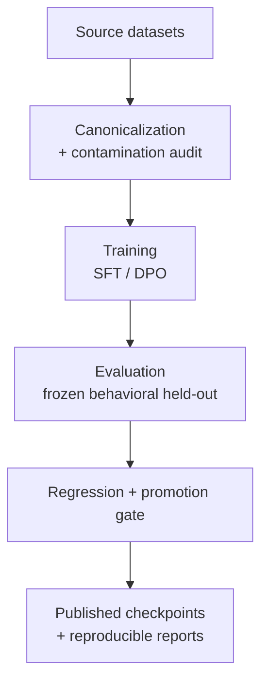

<div align="center">


# OpenGrad

**Every gradient is a hypothesis. Every checkpoint is evidence.**

</div>

OpenGrad is an empirical research repository for capability–efficiency tradeoffs in small
open-weight language models. It provides reproducible infrastructure for controlled post-training,
regression-aware evaluation, and provenance-preserving publication — and it keeps negative results
on the record rather than editing them away. The first study is reliable tool use in Qwen3.5-2B.

[](https://github.com/arjhinety/OpenGrad/actions/workflows/ci.yml)
[](pyproject.toml)
[](LICENSE)
[](reports/M1_DPO_EVALUATION.md)
[](https://huggingface.co/collections/arrochi112/opengrad-models-6aa3c7ea9ae58be5adbb113e)
[](https://huggingface.co/collections/arrochi112/opengrad-datasets-and-evaluation-records-6aa3c7eb4514d9bc27e5d160)

---

## Current Research Status

| Item | Current state |
|---|---|
| Base model | `Qwen/Qwen3.5-2B` at revision `15852e8c…` — the only executed target so far |
| Canonical dataset | **Canonical-v2 final** — 173,237 records, 161,966 trainable, 4 sources, fingerprint `8ced403b…` |
| Latest completed stage | **General-capability diagnosis** across Base → M0 → M1-v2 on real IFEval, GSM8K and MMLU-Pro. It found an **SFT-induced regression** the tool-policy gate could not see |
| Promoted model | [`OpenGrad-Qwen3.5-2B-M1-DPO-CanonicalV2-Final-v2`](https://huggingface.co/arrochi112/OpenGrad-Qwen3.5-2B-M1-DPO-CanonicalV2-Final-v2) — checkpoint 30. **Improved on tool policy; materially worse than Base on general capability. Not an unqualified improvement** |
| Next research stage | Refusal-supervision ablation — [`ROADMAP.md`](ROADMAP.md) step 16, **BLOCKED_ON_PREFLIGHT**. M2 distillation remains unexecuted scaffold |
| Behavioral held-out | When2Call — 3,650 examples. **Contains no ANSWER examples**, which is why the regression escaped promotion |
| Largest current limitation | One 2B model, one lineage, no replicate. The promoted checkpoint refuses 100% of bare arithmetic questions |

Every experiment record, its validity, selected checkpoint, and published artifact: [`docs/EXPERIMENT_STATUS.md`](docs/EXPERIMENT_STATUS.md) (generated from the run artifacts).

## Start Here

| I want to… | Start here |
|---|---|
| See the latest results | [Latest Results](#latest-results) · [`docs/EXPERIMENT_RESULTS.md`](docs/EXPERIMENT_RESULTS.md) |
| Download the promoted model | [Hugging Face model](https://huggingface.co/arrochi112/OpenGrad-Qwen3.5-2B-M1-DPO-CanonicalV2-Final-v2) |
| Run or inspect OpenGrad | [Quick Start](#quick-start) |
| Check what is executed vs. planned | [`docs/EXPERIMENT_STATUS.md`](docs/EXPERIMENT_STATUS.md) · [`ROADMAP.md`](ROADMAP.md) |
| Reproduce an experiment | [Baseline reproduction protocol](docs/experiments/BASELINE_REPRODUCTION_PROTOCOL.md) |
| Understand the methodology | [Research program](docs/research/research-program.md) · [Methodology](docs/research/methodology.md) |
| Add a benchmark or backend | [Adding a benchmark](docs/evaluation/ADDING_A_BENCHMARK.md) · [Adding a backend](docs/evaluation/ADDING_A_BACKEND.md) |
| Challenge a result | [CONTRIBUTING.md](CONTRIBUTING.md) · [Negative-result guide](docs/contributing/negative-result.md) |

**Contents:** [Current status](#current-research-status) · [Quick start](#quick-start) · [Latest results](#latest-results) · [How it works](#how-opengrad-works) · [Research program](#research-program) · [Datasets & evaluation](#datasets--evaluation) · [Limitations](#current-limitations) · [Reproducing](#reproducing-experiments) · [Repository structure](#repository-structure) · [Contributing](#contributing)

## Quick Start

Requirements: Python 3.11+ and [uv](https://docs.astral.sh/uv/). These commands are CPU-only: they
validate registries and fixtures and do not download models, run inference, or produce a benchmark
score.

```bash
git clone https://github.com/arjhinety/OpenGrad.git
cd OpenGrad
uv sync --extra dev

uv run opengrad-validate     # validate registries and schemas (the CI gate)
uv run opengrad-preflight    # capture the local environment and run fixture preflight
```

Useful inspection commands:

```bash
uv run opengrad status                                  # authoritative repository + experiment state
uv run opengrad experiment list                         # experiment records and lifecycle states
uv run opengrad results show                            # derived result index
uv run opengrad results validate-registry               # index vs. authoritative-artifact drift
uv run opengrad readiness configs/experiments/m0_sft_canonical_v2_final.yaml
```

`opengrad readiness` reports blocking gates that depend on local evidence and hardware
(materialized corpus, contamination adjudication, GPU probe, baseline artifacts), so a fresh clone
reports `FAIL` on those gates by design; the registry and configuration checks still pass.

> **Infrastructure validation is not an ML result.** Passing CPU tests validates contracts and
> fixtures, not model quality. The empirical results are in [Latest Results](#latest-results).

## Latest Results

The primary trajectory of Study 001. Scores are `call_f1` / `call_recall`; B0 is the full
held-out set (n=3,650) and M0/M1 are the pre-registered confirmatory partition.

| Stage | Intervention | Primary result | Status |
|---|---|---|---|
| **B0** | Base `Qwen/Qwen3.5-2B` | 0.6191 / 0.9722 — from a degenerate policy that calls on 64% of no-call items | Baseline |
| **M0** | Canonical-v2 SFT (checkpoint 1800) | 0.7470 / 0.7594 | Selected; **not promoted** (recall-regression gate) |
| **M1** | M1-v2 DPO calibration (checkpoint 30) | **0.7548 / 0.7748** | **PROMOTED** |
| **M2** | On-policy distillation | — | **Not executed** (mock-only scaffold) |

- Full intervention record, caveats, and published artifacts: [`docs/EXPERIMENT_RESULTS.md`](docs/EXPERIMENT_RESULTS.md)
- Promoted evaluation: [`reports/M1_DPO_EVALUATION.md`](reports/M1_DPO_EVALUATION.md)
- Derived result index: [`results/registry.jsonl`](results/README.md)

Seven post-training interventions have been executed in total: one negative on corpus v1, one
partial recovery on corpus v2, the definitive final-v2 (selected, not promoted), two joint-removal
ablations (both negative), a rejected historical DPO attempt, and the promoted M1-v2. Negative
results are not summarized away here; the full record is in [`docs/EXPERIMENT_RESULTS.md`](docs/EXPERIMENT_RESULTS.md).

### The tool-policy gain came with a general-capability regression

Those `call_f1` numbers are real. They are also not the whole picture. A later diagnosis across the
checkpoint ladder, on **real upstream IFEval, GSM8K and MMLU-Pro**, found a regression the
tool-policy gate was structurally unable to detect.

| measure | Base | M0 — SFT | M1-v2 — promoted |
|---|---:|---:|---:|
| GSM8K zero-shot accuracy | **67.4%** | **0.0%** | **0.0%** |
| GSM8K zero-shot refusal rate | 0.0% | **100.0%** | **100.0%** |
| GSM8K 8-shot accuracy *(same questions)* | **70.4%** | 56.3% | 55.5% |
| IFEval prompt-level strict | **67.8%** | 45.1% | 45.8% |
| MMLU-Pro (5-shot, 12,032 items) | **49.0%** | 37.0% | 37.0% |

**Two separable failures, both introduced at SFT:**

1. **A prompt-regime-conditioned refusal policy.** The promoted checkpoint declines every bare
   arithmetic question — and answers 55.5% of *the same 1,319 questions* when eight worked
   exemplars are present. It never refuses 5-shot MMLU-Pro. Refusal is conditioned on the request
   shape, not the subject.
2. **Genuine capability loss.** The 8-shot and MMLU-Pro gaps occur where refusal is ~0%, so they
   cannot be explained by declining to answer.

**Preference training changed neither** — `M0 → M1-v2` moves every metric by under 1pp, and 82% of
GSM8K generations are byte-identical between the two.

The original MMLU-Pro measurement used a 768-token budget and reported 38.0 / 36.8 / 36.9 —
apparently no regression at all. That was an artifact: Base hit the cap on 37.6% of items against
M0's 7.2%, so the benchmark was measuring verbosity. Re-run at 2048 tokens, the real gap is 12.0pp.
The superseded run is retained, not deleted.

- Independent audit of every number above: [`reports/FINAL_CAMPAIGN_AUDIT.md`](reports/FINAL_CAMPAIGN_AUDIT.md)
- Full diagnosis: [`reports/GENERAL_CAPABILITY_REGRESSION.md`](reports/GENERAL_CAPABILITY_REGRESSION.md)
- Machine-readable verdict: [`results/final_campaign_verdict.json`](results/final_campaign_verdict.json)

## What OpenGrad Is

Small open-weight models can run locally and cheaply, but their capabilities trade off in ways a
single headline score hides. OpenGrad asks whether controlled post-training can improve a specific
behavior — when and how a model uses tools — while measuring what regresses, at what cost, and with
what reproducibility. A recipe is not better because one metric rises: every intervention is
measured, every regression matters, and every reported result must be reproducible.

- Why these questions: [From deployment problems to research questions](docs/research/motivation.md)
- How claims are made: [Methodology](docs/research/methodology.md) · [Reproducibility](docs/research/reproducibility.md)
- What is retained: [Negative results](docs/contributing/negative-result.md) · [Incident log](docs/INCIDENT_LOG.md)

## How OpenGrad Works



Identity, semantics, and evidence are separated: `registry/` declares what things are, `src/opengrad/`
implements canonical data and evaluation contracts, `runs/` owns experiment state, and `reports/`
holds the written analyses. Deep architecture: [repository architecture](docs/architecture/repository.md)
and the [experiment foundation](docs/EXPERIMENT_FOUNDATION.md).

OpenGrad grew out of **OpenWeights**, an independent Android project that runs open-weight models on
consumer hardware: its deployment record exposed tool-use and efficiency problems that model
capability claims tend to hide. OpenGrad turns those observations into controlled model-level
experiments, and compatible checkpoints may later return to OpenWeights for device validation. The
projects are independently maintained. See [motivation](docs/research/motivation.md) and
[on-device testing](docs/evaluation/OPENWEIGHTS_ON_DEVICE_TESTING.md) — no device study has been
executed yet.

## Research Program

| RQ | Question |
|---|---|
| RQ1 — Reliable tool policy | Can controlled post-training improve **when and how** small models use tools, beyond the tool syntax already present in their instruct checkpoints? |
| RQ2 — Transfer | Do those improvements transfer into realistic agent runtimes and workload patterns? |
| RQ3 — Regression | What instruction-following, reasoning, calibration, latency, or robustness capabilities regress as tool reliability improves? |
| RQ4 — Distillation | When SFT reaches its ceiling, can on-policy distillation from a larger model improve the remaining decision-boundary failures? |
| RQ5 — Constrained inference | Can target-attached/native speculative decoding improve decode efficiency without the cost of a separate draft model? |
| RQ6 — Capability × efficiency | Do post-training gains survive quantization and optimized constrained-device inference? |

Full statements, the first study's scope, and the experimental decision pipeline:
[research program](docs/research/research-program.md). Stage-by-stage status: [`ROADMAP.md`](ROADMAP.md).

## Datasets & Evaluation

| Dataset release | Records | Role |
|---|---:|---|
| [Canonical-v2 final](https://huggingface.co/datasets/arrochi112/OpenGrad-ToolPolicy-Canonical-v2) | 173,237 (161,966 trainable) | **Current** training corpus |
| [Canonical-v1](https://huggingface.co/datasets/arrochi112/OpenGrad-ToolPolicy-Canonical-v1) | 213,951 | Historical; pinned by B0 and earlier results |
| [Partial-v2 snapshot](https://huggingface.co/datasets/arrochi112/OpenGrad-ToolPolicy-Canonical-v2-M0-snapshot) | 103,036 | Historical; corpus behind the first successful M0 |

Evaluation layers, and what has actually run in each:

| Layer | Purpose | Current status |
|---|---|---|
| Behavioral held-out | Tool-use policy (when to call, answer, clarify, refuse) | **Executed** — When2Call, 3,650 examples |
| External capability | General regressions and transfer | **Prepared, not executed** — 17 Tier A–E benchmarks, all frozen |
| Agent / runtime | Realistic transfer in agent loops | Planned |
| Systems | Latency, throughput, memory, spec decoding | Planned |

No external benchmark score exists: the runs under `reports/benchmarks/` used the deterministic mock
backend. Details: [benchmark inventory and counting convention](docs/benchmarks/README.md) ·
[benchmark strategy](docs/evaluation/BENCHMARK_STRATEGY.md) · [dataset releases](docs/publishing/huggingface-datasets.md) ·
[supervision contract](reports/SUPERVISION_CONTRACT_REPORT.md).

## Current Limitations

- **Scope:** the empirical record is one model family (Qwen3.5-2B). No cross-model replication has run.
- **External benchmarks:** all 17 Tier A–E benchmarks are prepared but not executed; there is no external score.
- **On-policy distillation:** scaffold only — the live training path is unimplemented and the one recorded M2 run is mock-only (`INVALID`).
- **Quantization (GGUF):** executed. Nine PTQ rungs were built from a BF16 GGUF with a frozen
  importance matrix and scored on the 1,277-example confirmatory partition. Only **Q6_K (1.45 GiB)
  and Q8_0 (1.87 GiB)** pass `quantization_preservation_v1`; every rung at Q5_K_M and below fails.
  Strict engine tokenizer parity **FAILED** on 6/1,277 prompts (a stock-llama.cpp `\p{M}`
  pre-tokenizer difference, all Thai) and was not redefined — see
  [`QUANTIZATION_ENGINE_PARITY.md`](reports/QUANTIZATION_ENGINE_PARITY.md) and
  [`QUANTIZATION_PTQ_EVALUATION.md`](reports/QUANTIZATION_PTQ_EVALUATION.md).
- **Quantization (ExecuTorch):** CPU/XNNPACK fp32 and 8da4w exported and audited (99.98% of
  named-data weights are int4); **no behavioural verdict** — scoring is run externally. Snapdragon
  is `REJECTED_EXPORT`; MediaTek is `BLOCKED_PORT_INCOMPLETE` (SDK now obtained, Gated DeltaNet
  layer unimplemented).
- **Device and speculation:** integration or reservation only; no on-device study, optimization
  run, or speculative benchmark exists. All throughput figures are A100-80GB, not device numbers.
- **Reproducibility gaps:** the historical M1-v1 DPO best checkpoints no longer exist, and some scaffold-era runs retain only metadata.
- **Measurement coverage:** tool selection, argument validity, and schema validity are not computed by the current evaluator.

## Reproducing Experiments

The B0 baseline, the M0 SFT lineage (including both ablations), and the M1 DPO runs are recorded and
reproducible from committed configs. The baseline workflow is specified in the
[baseline reproduction protocol](docs/experiments/BASELINE_REPRODUCTION_PROTOCOL.md): acquire the
accelerator, fetch the exact model revision, validate its native template and parser, run sanity
checks, execute the selected evaluations, compare revisions, and pass the reproduction gate. That
protocol is not executed by the CPU-only Quick Start commands.

Seeds, dataset hashes, model and tokenizer revisions, hardware, and failure analysis are recorded
per run under `runs/<experiment_id>/`; see [reproducibility](docs/research/reproducibility.md) and
the [results namespace](results/README.md).

## Repository Structure

```text
registry/       dataset, benchmark, model, runtime, and experiment contracts
src/opengrad/   canonical data, adapters/renderers, evaluation, gates, reporting
configs/        versioned experiment, data, evaluation, and inference definitions
runs/           authoritative experiment state (experiment.json, eval/, ledgers)
results/        derived, rebuildable result index
reports/        experiment analyses, baselines, releases, incident records
docs/           methodology and detailed technical documentation
integrations/   harness-facing integration (opengrad-mcp stdio server)
```

Full layout and boundaries: [repository architecture](docs/architecture/repository.md).

## Contributing

You do not need to agree with a result to contribute. Showing that a finding fails to reproduce is
valuable research: reproduce it with another seed or model family, challenge a dataset assumption,
compare inference implementations, or submit a failed reproduction. Start with
[CONTRIBUTING.md](CONTRIBUTING.md), the [reproduction PR guide](docs/contributing/reproduction-pr.md),
and the [negative-result guide](docs/contributing/negative-result.md). Do not commit checkpoints,
bulk datasets, credentials, or fabricated results.

Operate OpenGrad from an agent harness through the same documented `opengrad … --json` CLI; see the
[agent integration guide](docs/AGENT_INTEGRATION.md) and the
[MCP server](integrations/opengrad-mcp/README.md).

## Related Projects

- [OpenWeights](https://github.com/alpharomercoma/openweights) — independent on-device execution environment for compatible GGUF/llama.cpp and ExecuTorch artifacts; OpenGrad defines experiments and evidence, OpenWeights runs compatible artifacts.
- [OpenPapers](https://github.com/arjhinety/OpenPapers) — provenance-preserving scholarly retrieval used during active research; its findings are research inputs, not OpenGrad results.
- [Experimental Machines](https://experimentalmachines.org/) — the independent research group this program supports.

OpenGrad records upstream datasets, models, benchmarks, and papers in its registries; those sources
remain subject to their own licenses and attribution requirements.

## Citation and License

Please cite the repository using [CITATION.cff](CITATION.cff) until a formal release DOI exists.
Source code and documentation are licensed under [Apache-2.0](LICENSE).

---

<sub>Documentation map: this README is the landing page. Methodology and technical detail live in
[`docs/`](docs/), empirical analyses in [`reports/`](reports/), authoritative state in
[`runs/`](runs/) and [`registry/`](registry/), and the derived index in
[`results/registry.jsonl`](results/README.md). The last documentation restructure is recorded in
[`docs/README_INFORMATION_ARCHITECTURE_AUDIT.md`](docs/README_INFORMATION_ARCHITECTURE_AUDIT.md).</sub>
