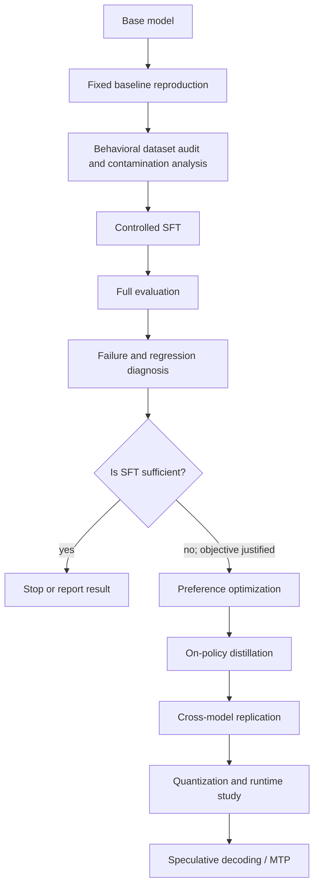

# Research program

The questions OpenGrad asks, the first study that carries them, and the decision process that
orders the stages. Rationale and provenance for these questions are in
[motivation.md](motivation.md); the measurement axes they are evaluated on are in
[Benchmark Strategy](../evaluation/BENCHMARK_STRATEGY.md).

## Research questions

| RQ | Question |
|---|---|
| RQ1 — Reliable tool policy | Can controlled post-training improve **when and how** small models use tools, beyond the tool syntax already present in their instruct checkpoints? |
| RQ2 — Transfer | Do those improvements transfer from controlled evaluations into realistic agent runtimes and workload patterns, such as those exposed by OpenWeights? |
| RQ3 — Regression | What ordinary instruction-following, reasoning, calibration, latency, or robustness capabilities regress as tool reliability improves? |
| RQ4 — Distillation | When SFT reaches its ceiling, can on-policy distillation from a larger model improve the remaining decision-boundary failures? |
| RQ5 — Constrained inference | Can target-attached/native speculative decoding improve small-model decode efficiency without the memory and runtime cost of maintaining a separate draft model? |
| RQ6 — Capability × efficiency | Do post-training gains survive quantization and optimized constrained-device inference? |

## Study 001 — Reliable tool use in small language models

The first track asks whether a small open-weight model can reliably decide **when and how** to use
tools while retaining ordinary instruction-following capability. It is not an attempt to add
tool-call grammar to a model that cannot serialize calls. It targets the decision boundary:
`CALL`, `DO NOT CALL`, `ASK FIRST`, `SELECT`, `GROUND ARGUMENTS`, `CHAIN`, `PARALLELIZE`,
`RECOVER`, and `STOP`.

**Status.** Carried through baseline measurement, a controlled SFT comparison, and a
preference-optimization stage, with the results recorded in [`docs/EXPERIMENT_RESULTS.md`](../EXPERIMENT_RESULTS.md).
On-policy distillation (RQ4) has not been run: its scaffold has no live training path, and the one
recorded M2 attempt is mock-only (see [`reports/M2_DECISION.md`](../../reports/M2_DECISION.md)).

The study will cover, as the corresponding evaluations are implemented:

- deciding whether to call a tool, answer directly, ask for clarification, or reject an unsupported request;
- selecting the correct tool and producing schema-valid, grounded arguments;
- parallel tool calls and sequential tool dependencies;
- consuming tool observations and handling tool failure;
- maintaining state across multi-turn tasks.

The first baseline is [`Qwen/Qwen3.5-2B`](../../registry/models.yaml), recorded as `qwen3.5-2b` at an
immutable revision in the [experiment definition](../../configs/experiments/tool_calling/qwen35_2b_baseline.yaml).

## Experimental decision pipeline

The roadmap is a decision process, not a mandatory recipe. Preference optimization is used only if
diagnosis identifies a failure that such an objective is appropriate to address, and later stages
require evidence from earlier stages.



Stage-by-stage status is tracked in [`ROADMAP.md`](../../ROADMAP.md).

## Capability × efficiency

Two related but distinct directions, deliberately kept separate so a gain in one is never mistaken
for a gain in the other:

| Capability | Efficiency |
|---|---|
| SFT; preference optimization when justified; distillation; tool use; specialization; robustness | Quantization; speculative decoding; draft/target decoding; native MTP; architecture-aware decoding; device deployment |

```text
             Capability
                 ↑
                 │       desirable region
                 │            ●
                 │
                 └────────────────────→ Efficiency
```

An efficiency gain is not automatically desirable if capability or reliability falls substantially.
The efficiency axis and its planned measurements are described in
[Efficiency research](../inference/efficiency.md); the capability axis follows
[Benchmark Strategy](../evaluation/BENCHMARK_STRATEGY.md).
