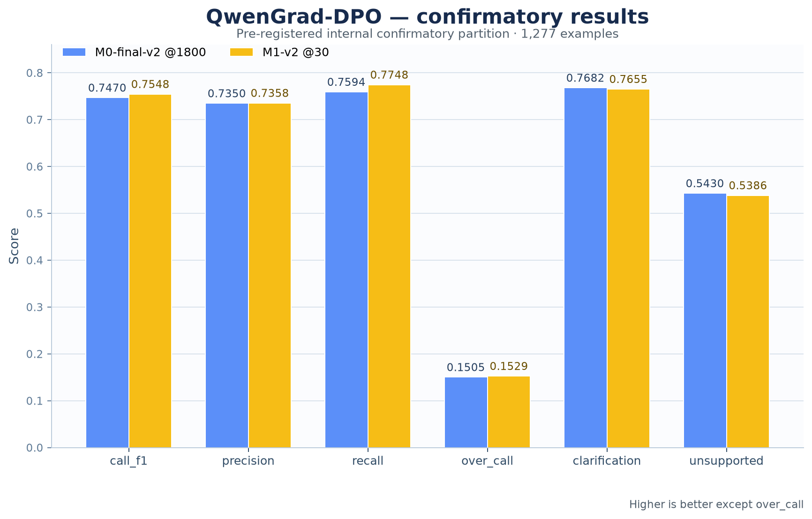

# OpenGrad — M1 DPO calibration on selected M0-final-v2

Direct Preference Optimization applied to the selected M0-final-v2 checkpoint, not to the
base model or a historical DPO checkpoint. Produced by [OpenGrad](https://github.com/arjhinety/OpenGrad).

**Research artifact, not a production model.**

## Known limitation: general-capability regression

**Do not use this checkpoint as a general-purpose assistant.** It is a research artifact for
tool-call routing: deciding whether to call a tool, ask for a missing detail, or decline.

It shows a general-capability regression associated with tool-policy post-training on
When2Call-derived data. It appears after SFT (M0) and also after DPO applied directly to the base
(M1-v1), so it is not specific to SFT. Causation is not established: one lineage, one seed, no
replicate.

| benchmark | Qwen3.5-2B base | M0-final-v2 @1800 | **M1-v2 @30 (this model)** |
|---|---:|---:|---:|
| GSM8K 0-shot accuracy | 67.4% | 0.0% | **0.0%** |
| GSM8K 0-shot refusals | 0 of 1,319 | 1,319 of 1,319 | **1,319 of 1,319** |
| GSM8K 8-shot accuracy | 70.4% | 56.3% | **55.5%** |
| IFEval prompt-level strict | 67.8% | 45.1% | **45.8%** |
| MMLU-Pro | 49.0% | 37.0% | **37.0%** |

Asked a GSM8K question with no exemplars, this model declines every time; with eight exemplars it
answers every question and gets 55.5% right. M1-v1
([`OpenGrad-Qwen3.5-2B-M1-DPO`](https://huggingface.co/arrochi112/OpenGrad-Qwen3.5-2B-M1-DPO),
DPO on the base model with no SFT) refuses 70.7% (933 of 1,319) of the same zero-shot questions;
its MMLU-Pro at the corrected budget is unmeasured. Source: `results/final_campaign_verdict.json`
in the repository.

## Results (pre-registered internal confirmatory partition, 1,277 examples)

The chart reports the exact values for `call_f1`, precision, recall, `over_call`, clarification,
and unsupported. Higher is better for every metric except `over_call`.

On tool routing, M1 stays at M0's operating point. The `call_f1` difference is +0.0078: 351
against 344 correct of the 453 CALL examples (+7), single seed, no interval, which is within
noise. Over-calling rose slightly (0.1505 → 0.1529) and clarification and unsupported accuracy
fell slightly; DPO did not lower over-calling. None of this addresses the capability regression
above.

## Evaluation and promotion

Checkpoint selection used the frozen DEV partition (2,373 examples, fingerprint `88a56821…`).
Checkpoint 30 had the highest DEV macro score (0.6768; checkpoint 60 was 0.6749, inside the
pre-registered 0.01 tolerance), so the earlier-checkpoint tie-break did not change the choice. The
confirmatory partition (fingerprint `d6d1e394…`) was then scored exactly once on checkpoint 30.

The `tool_use_promotion_v4` policy passed: precision/recall/macro floors, over-call
ceiling, clarification/unsupported floors, parse validity, and M0-relative regression checks.
Checkpoint 30 is **PROMOTED**. This policy does not compare recall to B0's degenerate always-call
recall.

**What the promotion means.** M1-v2 is promoted under a parent-relative gate (v4) introduced after
M0 was evaluated; M0 also clears v4, and M1-v2 fails the v3 gate that rejected M0. The promotion
reflects the gate change; the measured difference from M0 (+0.0078 `call_f1`, 7 of 453 calls,
single seed) is within noise. v4 was committed on 2026-09-11 at 17:10 UTC (`92ca2b9`), after M0's
confirmatory results were committed at 08:58 UTC (`26234c2`). Under `tool_use_promotion_v3`, the
B0-relative gate, all four M1-v2 DEV checkpoints are `REJECT`
(`runs/m1_dpo_canonical_v2_final_v2/eval/dev/selection--dev.json`).

The confirmatory partition is **pre-registered internal evidence, not an untouched external test**.
The evaluation population has no ANSWER examples, so `no_call_accuracy` is NA. Tool-selection
accuracy, argument validity, and schema validity are not computed by the current evaluator and are
not treated as satisfied.

## Frozen lineage

- Parent experiment: `m0_sft_canonical_v2_final`
- Parent checkpoint: `checkpoint-1800`
- Parent model hash: `7144579aeecec8b4de25f193ab63085efdf8d9d76b85ed915352291b0152277a`
- Preference dataset: 481 local calibration pairs, hash `d39168948d09fc3c355cd83f9f0857f310086322b0968fd2e7d78125150faef4`
- DPO: beta 0.05, learning rate 5e-7, cosine schedule, 120 steps, seed 42, bfloat16

The preference set combines deterministic base/M0 disagreements on Canonical-v2 training prompts
with a bounded curated When2Call training slice. Frozen behavioral evaluation IDs were excluded;
no paid external API was used. All pair origins and input hashes are recorded in the repository.

## Checkpoints

All retained checkpoints are published here: `dpo-checkpoint-30` (selected), 60, 90 and 120.
The first M1 identity is preserved in the repository as a failed 119/120-step run; it was not
silently overwritten.

## Intended use

Research artifact for tool-call routing. Not a general-purpose assistant (see the capability
regression above), not safety-tuned, not aligned, and not intended for autonomous tool use. It
inherits the limitations of its public training sources and its evaluator's unmeasured dimensions.
See the repository reports:

- `reports/M1_DPO_EXECUTION_REPORT.md`
- `reports/M1_DPO_EVALUATION.md`
- `reports/M2_DECISION.md`
